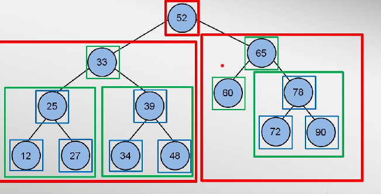
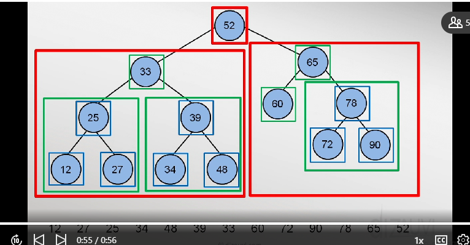
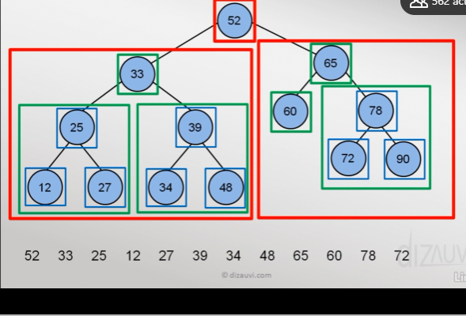
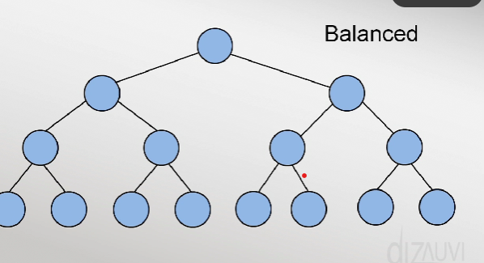
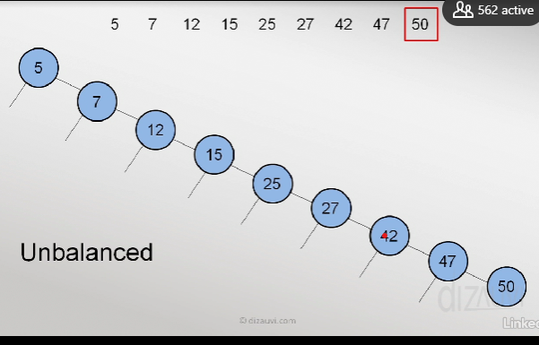

# Trees

### InOrder traversal

In an inorder traversal we go left center right in each subtree, starting with the smallest subtree.

### PostOrder Traversal

 left --> right --> root
### PreOrder Traversal

root --> left --> right

### Balanced vs unbalanced

Balanced

Unbalanced

### Height of a Tree...
Height of a tree is h
We have  (2^h-1) nodes in each layer of 'h' height.

### Time Complexity in tree operations
 To delete a node, O(log2N)
 TO add a node O(log2N)