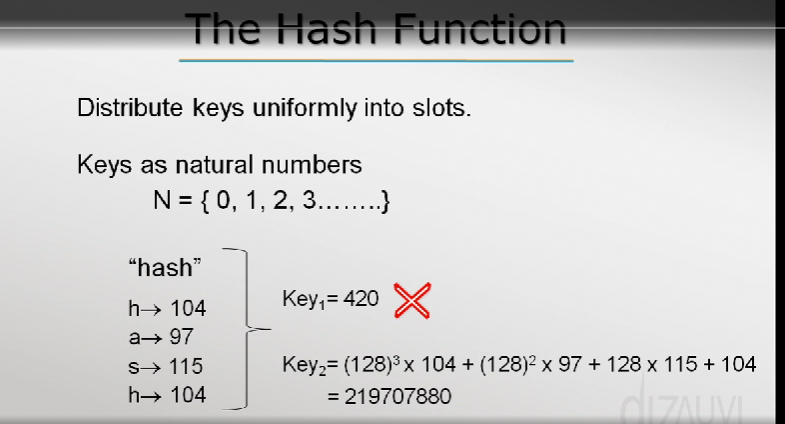

## Hash Table

Direct access table: A integer key mapped to a value.
Hash table: hash function h maps keys into slots of table T.

Load factor: n / m , where n is number of keys and m is number of slots in a table. calculates how much keys should be mapped to each slot.
Time complexity with a hash table implementing chaining is O( 1 + Load factor).

Usually we use a prime number for the size of a table.

really fast beacuse we access desired information using a key.
get(key) ---> O(1)
put(key) ---> O(1)

### Open Addressing(types of hashing)

Linear probing
h(k,i) = (h(k,0) + i) % m
Problem: can cause clustering in one section of table...

Quadratic probing
h(k,i) = (h(k,0) + i^2) % m

Double hashing
h(k,i) = (h1(k) + h2(k)) % m ===> Two different hash functions..
