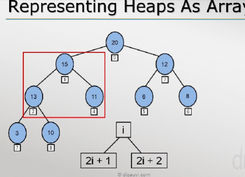

## Heaps

### A heap is a binary tree that is..  

1.) Complete.(adding root, left and then right child)
complete means nodes are added in the appropriate way.

2.) Every nodes key is larger than or equal to the keys of its children
(Different from binary search tree, where right is greater than its parent node)

Heap as priority queue..

