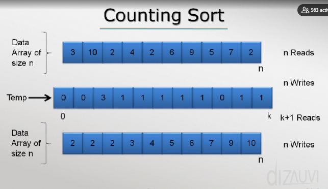
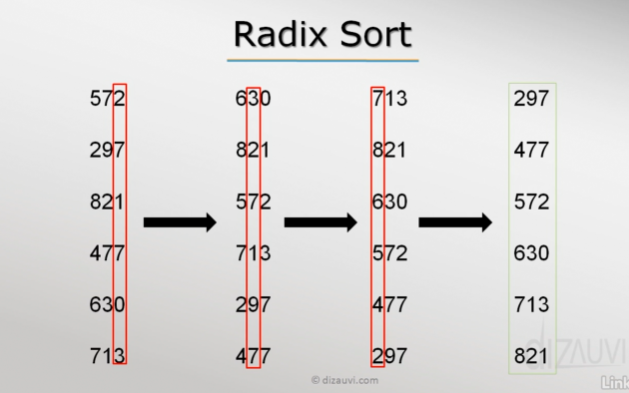

## Sorting Algorithms

### BubbleSort:
Bubblesort loops and compares values, the greater value gets put at j+1 position then we continue comparing that (j+1) element and the next element not compared yet, the array gets smaller each time we find the ith greatest element from the right. Sorts from the end of the array.

### CountingSort:
Data Array of size N , gives N reads.
Temp data array of elements of (n + 1) size,
has N writes (We write each value in its index then n+1 reads
then final data array size of n has n writes.( we count each index value, interating that number whatever the value is..
worst case: O(n)....

### RadixSort:
comparing by  (hundredths) --> (tens) --> (then ones place)

### ShellSort:

good for medium sized arrays...(Variation of Shell Sort...)

### BucketSort:

